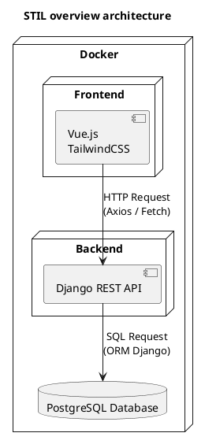

# Programmer Guide

> **Project Name:** Software Technology and Intelligence Research Lab (STIL)  
> **Version:** 1.0  
> **Last updated:** 2025-07-17  
> **Author(s):** 
The Minh Luong, Jean-Philippe Mongeau, Francis Leroux-Contant, Alexander Barcenes Flores, Hugo Rhéaume-Simard 

---

## Table of Contents

[1. Introduction](#1-introduction)  
[2. Technologies Used](#2-technologies-used)   
[3. Architecture Overview](#3-architecture-overview)  
[4. Development Environment Setup](#4-development-environment-setup)  
[5. Project Structure](#5-project-structure)  
[6. Importing data](#6-importing-data)   
[7. Using the API](#7-using-the-api)  
[8. Contribution Guidelines](#8-contribution-guidelines)  

---

## 1. Introduction

An interactive web platform to centralize, manage, and showcase the scientific activities of a software engineering research laboratory. This project aims to design and develop a structured website for a research laboratory. The goal is to centralize the lab’s key information and facilitate its management and dissemination, both internally and to the scientific and industrial community.

---

## 2. Technologies Used


---
## 3. Architecture Overview

High-level description of the system architecture.



---

## 4. Development Environment Setup

Steps to set up the project locally.
### Backend
1. Install [Docker](https://www.docker.com/products/docker-desktop).


2. From the root of the repository, create the virtual environment
```bash
python -m venv .venv
.\.venv\Scripts\activate # Windows
source .venv/bin/activate # Linux
pip install -r requirements.txt
pre-commit install # To install some pre-commit hooks to help with code quality
```

3. Create a `.env` file and add the following environment variables:

```yaml
DJANGO_DEBUG=True
DJANGO_LOG_LEVEL=DEBUG # Options are DEBUG, INFO, WARNING, ERROR and CRITICAL

DB_USER=CHANGE_ME
DB_PASSWORD=CHANGE_ME
DB_HOST=db
DB_PORT=5432
DB_NAME=postgres
```

4. Use the command:
```sh
docker compose build
docker compose up [--build] [-d] # --build to skip the first command, -d to run in detached mode
```

The database will be available at `localhost:5432` and pgAdmin at `localhost:5050`. The backend app will be available at `localhost:8000`

pgAdmin login credentials:

User: `admin@admin.com`  
Password: `admin123`

### Frontend
1. Install the required dependencies:
```sh
npm install
```

2. Start the application:
```sh
npm run dev
```
The application will be available locally at http://localhost:5173/

3. Run unit tests with coverage:
```sh
npm run test
```

### Prerequisites

- Node.js v22.14.0
- Python 3.13
- Docker
---

## 5. Project Structure
### Backend
```bash
backend/
├─ backend/
│   ├─ admin/
│   ├─ management/
│   ├─ migrations/
│   ├─ models/
│   ├─ serializers/
│   ├─ services/
│   ├─ test/
│   ├─ views/
├─ config/
├─ logs/
└
```

### Frontend
```bash
src/
├─ assets/
├─ components/
│  └─ publications/
│      ├─ index.ts
│      ├─ PublicationCard.vue
│      ├─ PublicationSortOptions.vue
│      └─ PublicationsPage.vue
├─ composables/
├─ data/
├─ middleware/
├─ test/
│  └─ publications/
│      ├─ index.ts
│      ├─ PublicationCard.spec.ts
│      ├─ PublicationSortOptions.spec.ts
│      └─ PublicationsPage.spec.ts
└
```

---

## 6. Importing data

Indications on how to import data

1. Set up the database

```bash
docker compose exec backend python manage.py migrate
docker compose exec backend python manage.py createsuperuser

# To create new migrations 
docker compose exec backend python manage.py makemigrations --name migration_name 
```

2. Synchronise publications

```bash
docker compose exec backend python manage.py getpublications [--fast | -f]
```

3. Insert legacy data
```bash
docker compose exec backend python manage.py insert_legacy_data 
```

---

## 7. Using the API
## Authentication
### `POST /api/register`
Create a new user
#### Example Request

```json
{
  "username": "johndoe",
  "email": "john@example.com",
  "password": "securePassword123",
  "first_name": "John",
  "last_name": "Doe",
  "role": "Researcher",
  "phone": "+1-555-1234",
  "biography": "Researcher in AI and ML.",
  "research_domain": "Artificial Intelligence",
  "image_url": "https://example.com/images/johndoe.jpg",
  "github_url": "https://github.com/johndoe",
  "linkedin_url": "https://linkedin.com/in/johndoe",
  "personal_website": "https://johndoe.dev"
}
```

#### Response
- **Status:** `201 Created`
- **Content-Type:** `application/json`
```json
{
  "message": "User registered successfully",
  "refresh_token": "eyJ0eXAiOiJKV1QiLCJhbGciOiJIUzI1NiJ9...",
  "access_token": "eyJ0eXAiOiJKV1QiLCJhbGciOiJIUzI1NiJ9...",
  "user": {
    "id": 42,
    "username": "johndoe",
    "email": "john@example.com"
  },
  "member_id": 15
}
```

### `POST /api/login`
Allow users to login via JWT
#### Example Request

```json
{
  "username_or_email": "john@example.com",
  "password": "securePassword123"
}
```

#### Response
- **Status:** `201 Created`
- **Content-Type:** `application/json`
```json
{
  "refresh_token": "eyJ0eXAiOiJKV1QiLCJhbGciOiJIUzI1NiJ9...",
  "access_token": "eyJ0eXAiOiJKV1QiLCJhbGciOiJIUzI1NiJ9...",
  "user": {
    "id": 42,
    "username": "johndoe",
    "email": "john@example.com"
  }
}
```


## Publications
### `GET /api/publications`

Retrieves a list of all publications.

#### Response
- **Status:** `200 OK`
- **Content-Type:** `application/json`
- **Body:** JSON array of publication objects.

#### Example Response

```json
[
    {
        "id": "https://openalex.org/W3121596715",
        "entrytype": "article",
        "citekey": "gaikovina2017do",
        "title": "Do developers update their library dependencies?",
        "author": "Gaikovina Kula, Raula and M. Germán, Daniel and Ouni, Ali and Ishio, Takashi and Inoue, Katsuro",
        "journal": "Empirical Software Engineering",
        "booktitle": null,
        "publisher": null,
        "year": 2017,
        "volume": "23",
        "number": "1",
        "pages": "384--417",
        "url": "https://doi.org/10.1007/s10664-017-9521-5",
        "is_approved": false,
        "bibtex": "@article{gaikovina2017do,\n  title={Do developers update their library dependencies?},\n  author={Gaikovina Kula, Raula and M. Germán, Daniel and Ouni, Ali and Ishio, Takashi and Inoue, Katsuro},\n  journal={Empirical Software Engineering},\n  year={2017},\n  volume={23},\n  number={1},\n  pages={384--417},\n  url={https://doi.org/10.1007/s10664-017-9521-5},\n}"
    }
]
```

---

### `POST /api/publications`

Creates a new publication.

#### Request
- **Content-Type:** `application/json`
- **Body:** JSON object representing the publication.

#### Example Request

```json
{
"id": "smith2023",
"entrytype": "article",
"citekey": "Smith2023",
"title": "Some Research Paper",
"author": "John Smith and Jane Doe",
"journal": "Journal of Examples",
"year": 2023,
"volume": "12",
"number": "3",
"pages": "123-130",
"url": "https://example.com/paper",
"is_approved": false
}
```

#### Response
- **Status:** `201 Created`
- **Content-Type:** `application/json`
- **Body:** The created publication object with its unique ID.

#### Error Responses

- `400 Bad Request` – Invalid or missing fields in request body.
- `500 Internal Server Error` – Server-side issue.

#### Publication already exist
 - `400 Bad Request` – A publication with this ID or citekey already exists.


## Profile
### `GET /api/profile`
Get profile of the authenticated user

#### Response
- **Status:** `200`
- **Content-Type:** `application/json`
```json
{
  "id": "aa85fd2b-f6a6-4f81-bc06-89a4d866afdf",
  "user": {
    "id": 42,
    "last_login": null,
    "is_superuser": false,
    "username": "test_user",
    "is_staff": false,
    "is_active": true,
    "date_joined": "2025-07-17T00:39:13.398628Z",
    "groups": [],
    "user_permissions": []
  },
  "first_name": "dev",
  "last_name": "dev",
  "role": "dev",
  "email": "dev@test.com",
  "phone": "123-456-7890",
  "biography": "biography...",
  "research_domain": "",
  "image_url": null,
  "github_url": "https://github.com",
  "linkedin_url": "https://www.linkedin.com/",
  "personal_website": "https://test.com/"
}
```
### `PUT /api/profile` or `PATCH /api/profile`
Update the profile of the authenticated user, partially or fully
#### Example Request

```json
{
  "first_name": "dev",
  "last_name": "dev",
  "role": "dev",
  "email": "dev@test.com",
  "phone": "123-456-7890",
  "biography": "biography...",
  "research_domain": "",
  "image_url": null,
  "github_url": "https://github.com",
  "linkedin_url": "https://www.linkedin.com/",
  "personal_website": "https://test.com/"
}
```
#### Response
- **Status:** `200`
- **Content-Type:** `application/json`
```json
{
  "id": "aa85fd2b-f6a6-4f81-bc06-89a4d866afdf",
  "user": {
    "id": 42,
    "last_login": null,
    "is_superuser": false,
    "username": "test_user",
    "is_staff": false,
    "is_active": true,
    "date_joined": "2025-07-17T00:39:13.398628Z",
    "groups": [],
    "user_permissions": []
  },
  "first_name": "dev",
  "last_name": "dev",
  "role": "dev",
  "email": "dev@test.com",
  "phone": "123-456-7890",
  "biography": "biography...",
  "research_domain": "",
  "image_url": null,
  "github_url": "https://github.com",
  "linkedin_url": "https://www.linkedin.com/",
  "personal_website": "https://test.com/"
}
```

## Members
### `GET /api/members`

Retrieves a list of all members.

#### Response
- **Status:** `200 OK`
- **Content-Type:** `application/json`
- **Body:** JSON array of members objects.

#### Example Response

```json
[
    {
        "id": "547815a2-342f-4177-b4a2-f6c8e3ea3b22",
        "user": null,
        "first_name": "Ali",
        "last_name": "Ouni",
        "role": "PRO",
        "email": "ali.ouni@etsmtl.ca",
        "phone": null,
        "biography": "Ali Ouni is a passionate software engineering researcher and educator. He is a Full Professor in the Department of Software Engineering and IT at École de technologie superieure (ÉTS Montréal), University of Quebec, where he leads the Software Technology and Intelligence Research Lab (STIL). He is the recipient of several prestigeous awards including the CS-Can/Info-Can Outstanding Early Career Computer Science Researcher Award, in 2023, the Research Ecellence Award (Releve) of the University of Quebec in 2023, the Research Ecellence Award-Emerging Researcher from ÉTS Montreal in 2021. He obtained his PhD degree in computer science from the University of Montreal where he was awarded the J. Armand Bombardier Research Excellence Award. Before joining ETS Montreal, he has been an assistant professor at Osaka University, Japan, and UAE University. He has served as a visiting researcher at Missouri University of Science and Technology, and University of Michigan. He has developed pioneering research work in the area of software engineering, software maintenance and evolution, software quality, and empirical software engineering. He leverages advanced artificial intelligence techniques to address challenges related to software products, processes, and stakeholders. His research work has repeatedly published in top venues in software engineering. He is the recipient of over 10 Best Paper awards at top-tier conferences (ICSOC 2024, MSR 2024 Mining Track, SIGCSE 2024, ICSOC 2022, MSR 2021 Mining Track, ICGSE 2020, ICSR 2020, IWoR 2019, Energies 2018, ICWS 2016) and has been done in collaboration with and/or adopted by major industrial software companies. He won the 10-year Most Influential Paper Award (MIP) at IEEE ICPC 2021. He is a member of the IEEE.",
        "research_domain": null,
        "image_url": null,
        "github_url": null,
        "linkedin_url": null,
        "personal_website": null,
        "status": "CRT"
    }
]
```

---

## 8. Contribution Guidelines

- Create a branch
```bash
git checkout -b feat_my-new-feature
```
- Make your changes
- Create a pull request
- Merge when your changes have at least one approval AND when the CI pipelines are passing

---
