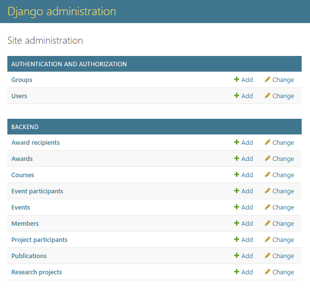

# Programmer Guide

> **Project Name:** Software Technology and Intelligence Research Lab (STIL)  
> **Author(s):** 
The Minh Luong, Jean-Philippe Mongeau, Francis Leroux-Contant, Alexander Barcenes Flores, Hugo Rhéaume-Simard 

---

## Table of Contents

[1. Introduction](#1-introduction)  
[2. Technologies Used](#2-technologies-used)   
[3. Architecture Overview](#3-architecture-overview)  
[4. Project Structure](#4-project-structure)  
[5. Development Environment Setup](#5-development-environment-setup)  
[6. Importing data](#6-importing-data)   
[7. Using the API](#7-using-the-api)  
[8. Create an Admin user](#8-create-an-admin-user)  
[9. Contribution Guidelines](#9-contribution-guidelines)  

---

## 1. Introduction

An interactive web platform to centralize, manage, and showcase the scientific activities of a software engineering research laboratory. This project aims to design and develop a structured website for a research laboratory. The goal is to centralize the lab’s key information and facilitate its management and dissemination, both internally and to the scientific and industrial community.

---

## 2. Technologies Used

| Layer            | Technology                  |
| ---------------- | ------------------------------------ |
| Frontend         | VueJS + TypeScript                   |
| Backend          | Python, Django                       |
| Authentication   | JWT       |
| Database         | PostgreSQL                           |
| DevOps           | Docker, GitHub Actions, Render       |
| Testing          | Vitest, Pytest           |

---
## 3. Architecture Overview

High-level description of the system architecture.


## 4. Project Structure
### Backend
```bash
backend/
├─ backend/
│   ├─ admin/
│   ├─ management/
│   ├─ migrations/
│   ├─ models/
│   ├─ serializers/
│   ├─ services/
│   ├─ templates/
│   ├─ test/
│   ├─ views/
├─ config/
├─ logs/
└
```

### Frontend
```bash
src/
├─ assets/
├─ components/
│  └─ publications/
│      ├─ index.ts
│      ├─ PublicationCard.vue
│      ├─ PublicationSortOptions.vue
│      └─ PublicationsPage.vue
├─ composables/
├─ data/
├─ middleware/
├─ test/
│  └─ publications/
│      ├─ index.ts
│      ├─ PublicationCard.spec.ts
│      ├─ PublicationSortOptions.spec.ts
│      └─ PublicationsPage.spec.ts
└
```

---

## 5. Development Environment Setup

Steps to set up the project locally.   
Clone the project
```bash
git clone https://github.com/stilab-ets/stilab-ets.github.io.git
```
### Backend
1. Install [Docker](https://www.docker.com/products/docker-desktop).


2. From the root of the repository, create the virtual environment
```bash
python -m venv .venv
.\.venv\Scripts\activate # Windows
source .venv/bin/activate # Linux
pip install -r requirements.txt
pre-commit install # To install some pre-commit hooks to help with code quality
```

3. Create a `.env` file and add the following environment variables:

```yaml
DJANGO_DEBUG=True
DJANGO_LOG_LEVEL=DEBUG # Options are DEBUG, INFO, WARNING, ERROR and CRITICAL

DB_USER=CHANGE_ME
DB_PASSWORD=CHANGE_ME
DB_HOST=db
DB_PORT=5432
DB_NAME=postgres

EMAIL_HOST=SMTP_SERVER_HOST
EMAIL_PORT=SMTP_SERVER_PORT
EMAIL_USE_TLS=False
EMAIL_HOST_USER=email@example.com
EMAIL_HOST_PASSWORD=CHANGE_ME
BACKEND_URL="https://www.backend.example"

VITE_API_BASE_URL=http://localhost:8000
```

4. Use the command:
```sh
docker compose build
docker compose up [--build] [-d] # --build to skip the first command, -d to run in detached mode
```

5. To run tests:
```bash
docker compose exec backend sh -c "export DJANGO_SETTINGS_MODULE=config.settings && pytest --cov=backend --cov-report=term --cov-fail-under=60 --cov-config=.coveragerc"
```

The database will be available at `localhost:5432` and pgAdmin at `localhost:5050`. The backend app will be available at `localhost:8000`

pgAdmin login credentials:

User: `admin@admin.com`  
Password: `admin123`

The mailhog server to test email delivery is available at `localhost:8025`.

### Frontend
1. Install the required dependencies:
```sh
npm install
```

2. Start the application:
```sh
npm run dev
```
The application will be available locally at http://localhost:5173/

3. Run unit tests with coverage:
```sh
npm run test
```

### Prerequisites

- Node.js v22.14.0
- Python 3.13
- Docker
---

---

## 6. Importing data

Indications on how to import data

1. Set up the database

```bash
docker compose exec backend python manage.py migrate
docker compose exec backend python manage.py createsuperuser

# To create new migrations 
docker compose exec backend python manage.py makemigrations --name migration_name 
```
The Django admin will be available at `localhost:8000/admin` with the credentials created previously with the createsuperuser command

2. Synchronise publications

```bash
docker compose exec backend python manage.py getpublications [--fast | -f]
```

3. Insert legacy data
```bash
docker compose exec backend python manage.py insert_legacy_data 
```

---

## 7. Using the API

After starting the backend application, you can find the API documentations at http://localhost:8000/swagger

---

## 8. Create an Admin user
To create an Administrator user who can access to the administrator dashboard in the frontend, follow these steps:   
1. Create a superuser and note the email and password: 
```bash
docker compose exec backend python manage.py createsuperuser
```
2. Access the Django admin panel (log in with the created superuser). The admin panel is available at http://localhost:8000/admin after starting the backend.
3. After logging in, you should see this panel :   
   
4. Click on Members and create a new member.
5. Go to pgAdmin at http://localhost:5050/   
    pgAdmin login credentials:   
    User: `admin@admin.com`  
    Password: `admin123`
6. Find the id (primary key) of your superuser (from auth_user)
```sql
SELECT * FROM auth_user;
```
7. Find the id (primary key) of the created member at step 4 (from backend_member)
```sql
SELECT * FROM backend_member;
```
8. Run this command to link the superuser with the created member : 
```sql
UPDATE backend_member
SET user_id = <superuser id>
WHERE id = '<backend_member id>';
```
9. Sign in in the frontend application as your superuser.
10. Administrator dashboard should be available.   
   

---

## 9. Contribution Guidelines

- Create a branch
```bash
git checkout -b feat_my-new-feature
```
- Make your changes
- Create a pull request
- Merge when your changes have at least one approval AND when the CI pipelines are passing

---
