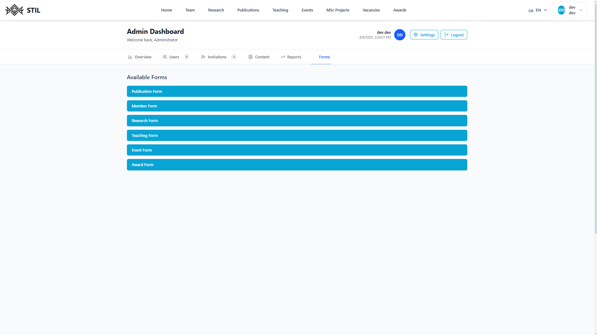

# Admin Guide

## Table of Contents

1. [Dashboard Overview](#dashboard-overview)
2. [Users Management](#users-management)
3. [Member Invitations](#member-invitations)
4. [Content Mangement](#content-mangement) 
5. [Reports](#reports)  
6. [Forms](#forms)  
    6.1. [Publication Creation](#publication-creation)  
    6.2. [Member Creation](#member-creation)  
    6.3. [Research Creation](#research-creation)  
    6.4. [Teaching Creation](#teaching-creation)  
    6.5. [Event Creation](#event-creation)

---

### Dashboard Overview

>`TODO`

---

### Users Management

>`TODO`

---

### Member Invitations

>`TODO`

---

### Content Mangement

>`TODO`

---

### Reports

The admins can find, in their dashboard, a report page that can show useful informations such as the statisics on the content of the website and also statisics for it users.

---

### Forms

There is multiple forms avaible for admins to use to manage the contents.

- Publications
- Members
- Researches
- Teaching
- Events

#### Publication Creation

The admins can create directly a new publication by entering the informations into the proposed fields.

They can also import the BibTeX by pasting it in the avaible field marked as `Import from BibTeX`.

After filling the fields, the admins can either `Cancel` or `Create`.

#### Member Creation

The admins can create a member <u>not</u> associated with a registered user. This mean, the member created can not login with the information used for the creation.

The purpose of this form is to associate possible external members without them needing to create an account. If they want to properly register an account later, the admin can delete the old member and edit, for exemple, a publication to associate the correct member.

#### Research Creation

The admins can create researches. This form also allow to associate members to it and add relevant urls like a custom one for the research and a github url.

The end date of the research can be empty if the research is still beeing worked on or simply not ended.

#### Teaching Creation

The admins can use the teaching form to create courses. They can also associate a member to it.

#### Event Creation

Like the other forms, the admins can create events by filling the fields of the form. They have the ability to associate a member as a speaker for the event. They can also add a custom url for the registration of the event.

---
