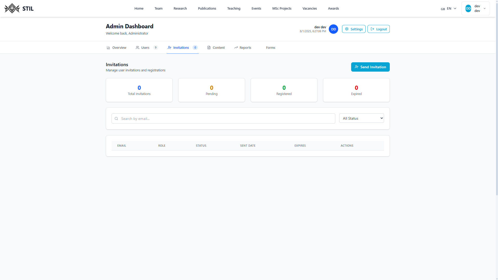

# Admin Guide

## Table of Contents

1. [Dashboard Overview](#dashboard-overview)
2. [Users Management](#users-management)
3. [Member Invitations](#member-invitations)
4. [Content Mangement](#content-mangement) 
5. [Reports](#reports)  
6. [Forms](#forms)  
    6.1. [Publication Creation](#publication-creation)  
    6.2. [Member Creation](#member-creation)  
    6.3. [Research Creation](#research-creation)  
    6.4. [Teaching Creation](#teaching-creation)  
    6.5. [Event Creation](#event-creation)  
    6.6. [Award Creation](#award-creation)
7. [Django Dashboard](#django-dashbord)

### Dashboard Overview
---

When admins access their dashboard, the first page they will see is this overview. It contains useful data and provides quick access to other functionalities.

### Users Management
---

This page displays an overview of user statistics and a list of current users, including their name, email, role, join date, and an option to directly edit their profile.

Admins can also create a new user by clicking the Add User button, which uses the same form as the [Member Form](#member-creation)  page.

### Member Invitations
---

This page shows a list of current invitations sent by admins. The list can be filtered by status. New invitations can be created using the `Send Invitation` button. Admins must provide a valid email and assign a role to the invitee.

### Content Mangement
---

This page displays a list of recent content. Admins can view the status of each item (e.g., `pending` if it awaits approval).

### Reports
---

The Reports page provides useful information, such as statistics about website content and user activity.

### Forms
---

Several forms are available for admins to manage different types of content:

- [Publications](#publication-creation)  
- [Members](#member-creation)  
- [Researches](#research-creation)  
- [Teaching](#teaching-creation)  
- [Events](#event-creation)

#### Publication Creation
---

Admins can create a new publication directly by entering the information into the provided fields.

They can also import a BibTeX entry by pasting it into the available field marked as `Import from BibTeX`.

After filling the fields, the admins can either `Cancel` or `Create`.

#### Member Creation
---

Admins can create a member <u>not</u> associated with a registered user. This means the created member cannot log in using the information provided during creation.

The purpose of this form is to associate possible external members without requiring them to create an account. If they wish to register properly later, the admin can delete the old member and, for example, edit a publication to associate the correct member.

#### Research Creation
---

Admins can create research entries. This form allows them to associate members by selecting them from the available list (hold the `ctrl` or `shift` key to select multiple members). They can also add relevant URLs, such as a custom one for the research and a GitHub URL.

The end date of the research can be left empty if the research is still ongoing or not yet concluded.

#### Teaching Creation
---

Admins can use the teaching form to create courses. They can also associate a member with the course.

#### Event Creation
---

Like the other forms, admins can create events by filling in the form fields. They have the ability to associate a member as a speaker for the event. They can also add a custom URL for event registration.

#### Award Creation
---

Admins can create award entries by specifying basic information and the award details.

This form allows admins to associate members as Recipients by selecting them from the available list (hold the `ctrl` or `shift` key to select multiple members).

### Django Dashboard
---

All admin functionalities are also available directly in the Django admin dashboard. To access it, navigate to the backend URL followed by `/admin` (local: http://localhost:8000/admin). You will be greeted by a login prompt where you can enter the same credentials as your admin account (username and password):

Once logged in, all the previous forms are also available here. Admins have the ability to create, update, and delete all website content from this interface.

