# User guide

This guide provides an overview of the different sections of the website and how to interact with them as a normal user.

## Table of Contents
1. [Homepage](#homepage)
2. [Team](#team)
3. [Research](#research)
4. [Publications](#publications)
5. [Teaching](#teaching)
6. [Events](#events)
7. [Awards](#awards)
8. [Language](#language)
9. [Login/Profile](#login-profile)

## Homepage

The homepage offers a quick overview of the lab's activities. You’ll find:
- Key statistics (e.g., number of publications, active projects, researches).
- Quick access links to other sections of the site.

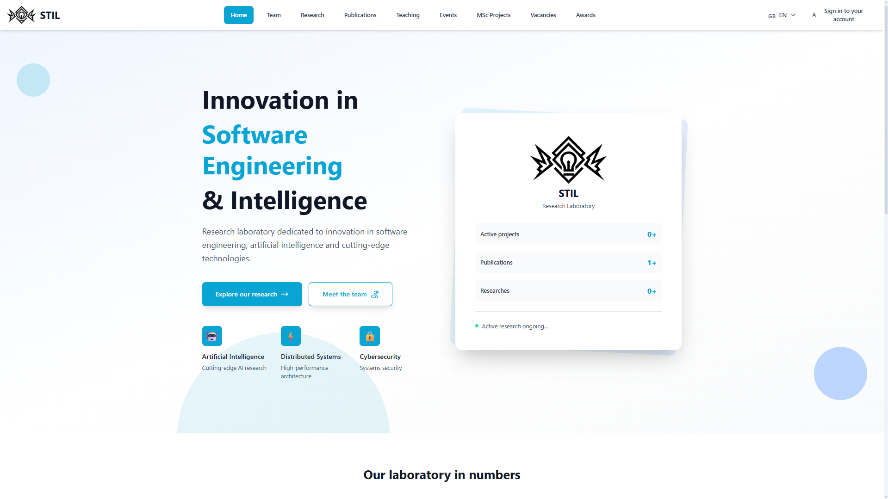

## Team

This page lists all lab members, including:
- Professors
- PhD students
- Master's students

You can filter and search the list using:
- <b>Status</b>: Active, Alumni, or All
- <b>Research Domains</b>
- <b>Search Bar</b>: Search by name or other keywords

Each member card provides a brief summary and linked to more detailed profiles

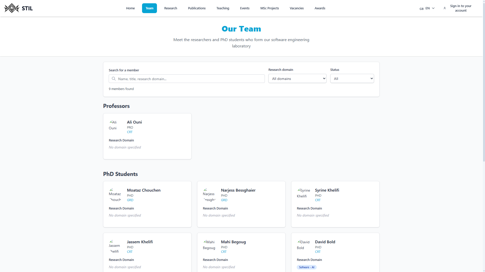

## Research

A list of research projects carried out by the lab.
- Each item includes a title, description, leader, and relevant links.
- Some stat shows how many active projects are ongoing

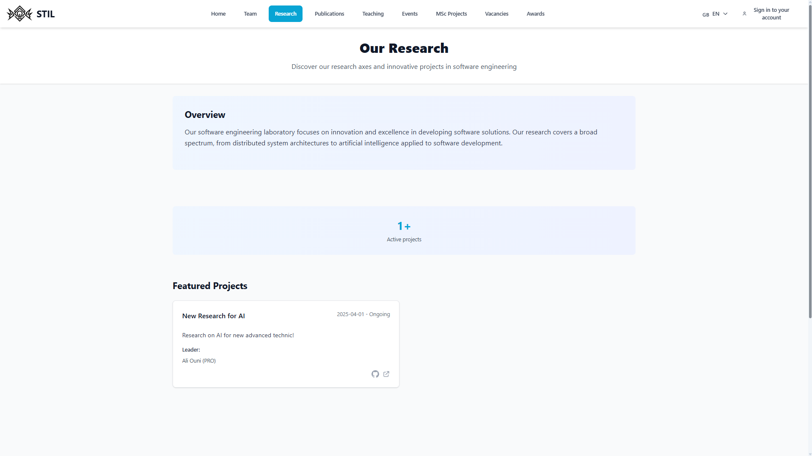

## Publications

This is the main focus of the website — a comprehensive list of all lab publications.

You can:

- Search by title or author
- Filter by:
    - Year
    - Type
- Sort:
    - By year (ascending/descending)
    - By title

Each publication displays its metadata and links to full texts or BibTeX entries.

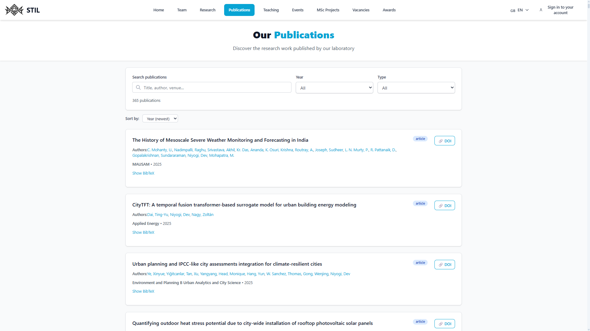

## Teaching

A list of courses taught by lab members.

Each course entry includes:
- The course code
- Whether it's for undergraduate or graduate level
- The professor responsible
- The term/session it will be given (e.g., Fall 2025)

The `Syllabus` button redirects you to the official ÉTS course page.

Useful statistics are also shown, such as the number of current courses, number of instructors, etc.

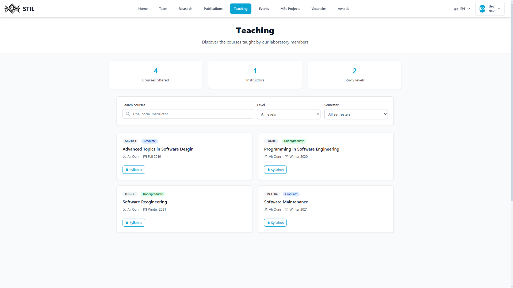

## Events

List of events organized or promoted by the lab.

You can:
- Filter by:
    - Status (Upcoming, Past)
    - Type

Each event includes a description, speaker, and registration info.

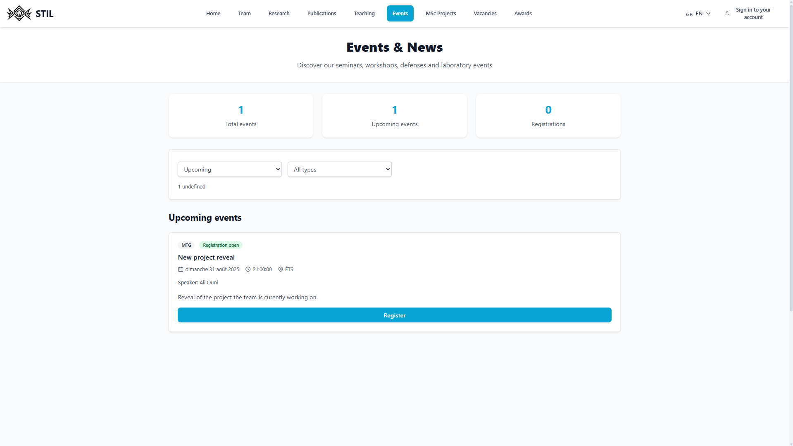

## Awards

This section lists awards received by lab members or associated with lab activities.

You can filter by:
- Year
- Organization
- Member

Useful stats (e.g., number of awards by year or member) are displayed at the top of the page.

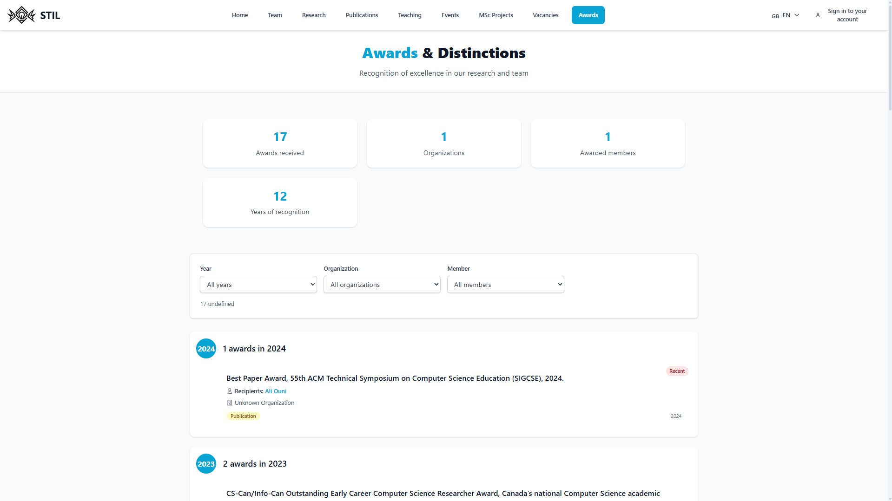

## Language

You can change the language to `EN` or `FR` by selecting it in the top right corner.

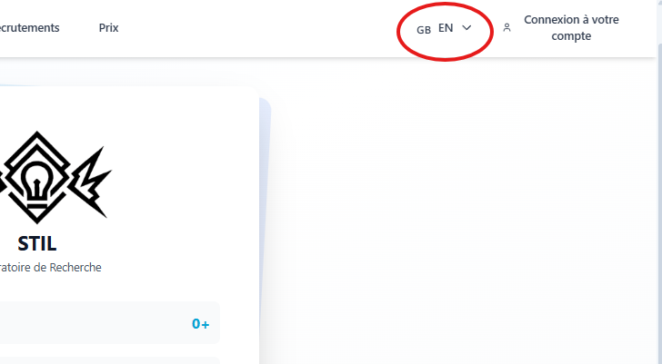
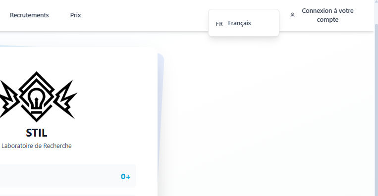

## Login-Profile

If you are not already authenticated, you can by clicking on the sign in button found in the top right corner.

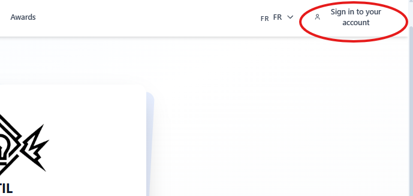

To authenticate yourself, provide your email and password in the form.

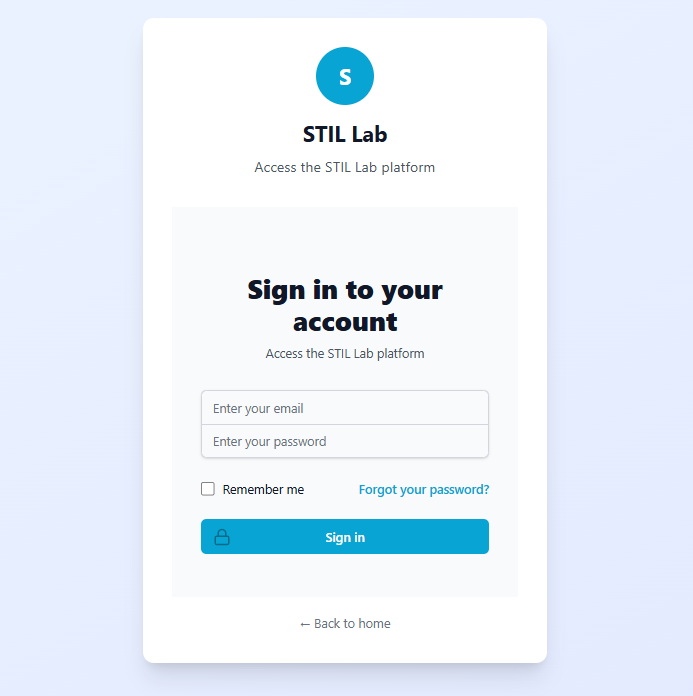

When authenticated, you can navigate to your profile. In this example, the user is an admin so there's more options, which can be found in the [Admin Guide](adminGuide.md)

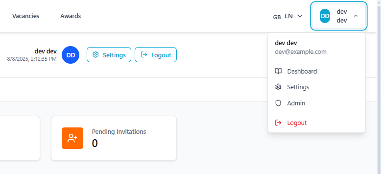

